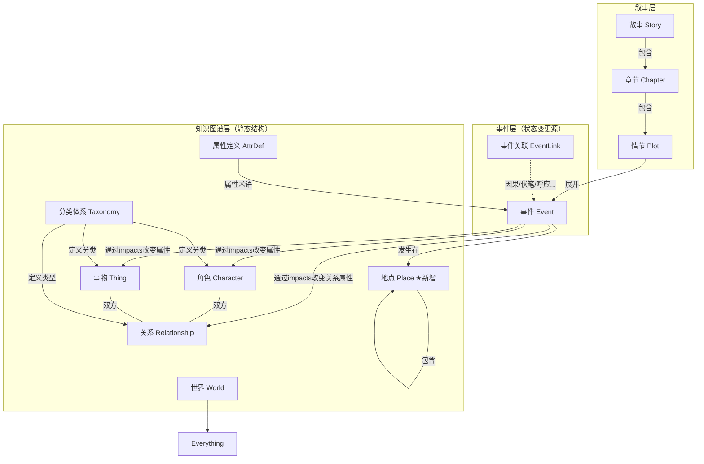

# 模型与 API 演进计划

基于架构评审的结论，本文档汇总所有待实施的模型与 API 变更，作为后续开发的指导。

---

## 变更总览

| # | 变更 | 影响范围 | 优先级 |
|---|------|---------|--------|
| 1 | Place 独立实体 | models / api / controllers / routes / db / frontend | P0 |
| 2 | 去掉 participantIds，按 impacts 建立实体→事件索引 | models / api / controllers / db / frontend | P0 |
| 3 | 去掉 AttributeChange.entityType | models / controllers / frontend | P0 |
| 4 | impacts 引用完整性验证 | controllers(events) | P0 |
| 5 | 关系属性状态计算 | controllers(state) / api / routes | P1 |
| 6 | 事件后属性快照 + 批量状态查询 | controllers / db / api / routes | P1 |
| 7 | EventLink 类型标注 | models / api / controllers / frontend | P2 |
| 8 | 删除世界级联清除 | controllers(worlds) / db | P2 |

---

## 1. Place 独立实体

### 设计动机

- **空间是基础维度**：Place 与时间（Event.time）、属性（AttributeDefinition）同层级，是故事世界的三根支柱之一。
- **层级关系**：地点天然有包含关系（国 → 州 → 城 → 街 → 建筑 → 房间），Thing 虽然有分类层级，但每个 Thing 本身是独立的，无法表达实例间的空间包含关系。
- **无生灭**：地点是永恒的空间容器，不参与生命周期机制（没有 `$alive`、`$age`、`endEventId`）。

### 模型设计

```typescript
// shared/protocol/models.ts

export const plcId = id.refine((v) =>
  isValidIdWithPrefix(v, EntityPrefix.Place),
);

export const PlaceSchema = z.object({
  id: plcId,
  worldId: wldId,
  /** 地点名称 */
  name: z.string(),
  /** 父地点 ID，null 表示顶层地点 */
  parentId: plcId.nullable(),
  /** 地点描述 */
  description: z.string().default(""),
  createdAt: z.string(),
  updatedAt: z.string(),
});
```

**与 Thing 的区别：**

| | Place | Thing |
|---|---|---|
| 实例层级 | 有（parentPlaceId） | 无（分类树有层级，实例独立） |
| 生命周期 | 无（永恒容器） | 有（创建→存续→消亡） |
| 事件溯源 | 不参与（无可变属性） | 参与（属性由事件推算） |
| 分类体系 | 不需要 | 属于 THING 分类树 |
| 语义 | 纯空间容器 | 有属性的抽象/具象事物 |

### ID 前缀

新增 `plc` 前缀：

```
EntityPrefix.Place = "plc"
```

### API 设计

| 方法 | 路径 | 说明 |
|------|------|------|
| POST | `/api/worlds/:worldId/places` | 创建地点 |
| GET | `/api/worlds/:worldId/places` | 列出地点（返回完整树） |
| GET | `/api/worlds/:worldId/places/:placeId` | 获取地点详情 |
| PUT | `/api/worlds/:worldId/places/:placeId` | 更新地点 |
| DELETE | `/api/worlds/:worldId/places/:placeId` | 删除地点 |

```typescript
// shared/protocol/api.ts
export const CreatePlaceBody = z.object({
  name: z.string().min(1),
  parentId: plcId.nullable().default(null),
  description: z.string().optional(),
});
export const UpdatePlaceBody = CreatePlaceBody.partial();
```

### Event.placeId 变更

```diff
// EventSchema
- placeId: thgId.nullable(),
+ placeId: plcId.nullable(),
```

### DynamoDB 存储

```
pk = WORLD#{worldId}
sk = PLACE#{placeId}
```

新增 key/prefix：
```typescript
export const placeSk = (placeId: string) => `PLACE#${placeId}`;
export const PREFIX = { ..., PLACE: "PLACE#" };
```

### 删除约束

- 删除地点前检查：没有子地点引用它作为 parentId。
- 删除地点前检查：没有事件引用它作为 placeId。
- 或者：级联将子地点的 parentId 设为被删地点的 parentId（提升一级）。

---

## 2. 去掉 participantIds，改为实体→事件关联索引

### 设计动机

用户需要的是"按角色、事物、关系的相关性检索事件"的能力。`participantIds` 只是达成这一目标的一种（且语义模糊的）手段。

更精确的做法：**事件与实体的关联性由 impacts 声明天然蕴含**——如果一个事件改变了某个实体的属性，那么这个事件就与该实体相关。

### 模型变更

```diff
export const EventSchema = z.object({
  id: evtId,
  worldId: wldId,
  time: z.number(),
  duration: z.number().default(0),
  placeId: plcId.nullable(),
- participantIds: z.array(entityId).default([]),
  content: z.string(),
  impacts: StateImpactSchema.default({
    attributeChanges: [],
    relationshipAttributeChanges: [],
  }),
  system: z.boolean().default(false),
  createdAt: z.string(),
  updatedAt: z.string(),
});
```

### 实体→事件索引的重建逻辑

当前 `putEvent()` 从 `participantIds` 生成反向索引条目。变更后从 impacts 中提取：

```typescript
function extractAffectedEntityIds(evt: Event): string[] {
  const ids = new Set<string>();

  // 属性变更关联的实体
  for (const ac of evt.impacts.attributeChanges) {
    ids.add(ac.entityId);
  }

  // 关系属性变更关联的关系
  for (const rac of evt.impacts.relationshipAttributeChanges) {
    ids.add(rac.relationshipId);
  }

  return [...ids];
}
```

`putEvent()` 改为对 `extractAffectedEntityIds(evt)` 的结果写反向索引条目（替代原来的 `participantIds.map(...)`）。`deleteEvent()` 也对应修改。

### 系统事件（创生/消亡）的适配

系统事件当前依赖 `participantIds` 判断是纪元事件还是创生/消亡事件。

**变更后判断逻辑：**

| 事件类型 | 判断条件 |
|---------|---------|
| 纪元事件 | `system=true` 且 `impacts.attributeChanges` 为空 |
| 创生事件 | `system=true` 且 impacts 中有 `$alive=true` |
| 消亡事件 | `system=true` 且 impacts 中有 `$alive=false` |

纪元事件也可以通过 `time === 0 && system === true && impacts为空` 来识别。

### 新增 API 端点

```
GET /api/worlds/:worldId/entities/:entityId/events
```

返回与该实体相关的所有事件（通过反向索引查询 + 二次获取完整事件数据）。

支持可选过滤参数：`?timeFrom=N&timeTo=N`

### 需要同步修改的控制器逻辑

| 位置 | 变更 |
|------|------|
| `events.create()` | 去掉 `validateParticipantsAlive`（改为 impacts 完整性验证，见变更 4） |
| `events.update()` | 同上；系统事件判断从 `participantIds.length` 改为 impacts 判断 |
| `events.remove()` | 清理 endEventId 时，从 impacts 中提取实体 ID 而非 participantIds |
| `characters.create()` | 创生事件不再设 participantIds |
| `things.create()` | 同上 |
| `relationships.create()` | 同上 |
| `characters.end()` | 消亡事件不再设 participantIds |
| `things.end()` | 同上 |
| `relationships.end()` | 同上 |
| `state.computeState()` | 不受影响（已经通过 ENTITY# 索引查事件） |

---

## 3. 去掉 AttributeChange.entityType

### 设计动机

`entityType` 可以从 `entityId` 的 3 字符前缀推导出来（`chr` → character, `thg` → thing）。保留冗余字段增加前端出错的风险。

### 模型变更

```diff
export const AttributeChangeSchema = z.object({
- entityType: z.enum(["character", "thing"]),
  entityId: entityId,
  attribute: z.string(),
  value: z.union([z.string(), z.number(), z.boolean()]),
});
```

后端需要实体类型时，从 `entityId.slice(0, 3)` 推导：

```typescript
function entityTypeFromId(id: string): "character" | "thing" | "relationship" {
  const p = id.slice(0, 3);
  if (p === "chr") return "character";
  if (p === "thg") return "thing";
  if (p === "rel") return "relationship";
  throw new Error(`Unknown entity prefix: ${p}`);
}
```

### 影响范围

- `shared/protocol/models.ts`：删除 `entityType` 字段
- `backend/src/controllers/characters.ts`：创生事件 impacts 中去掉 `entityType`
- `backend/src/controllers/things.ts`：同上
- `backend/src/controllers/relationships.ts`：同上
- `frontend/src/pages/EventListPage.tsx`：事件编辑表单中去掉 entityType

---

## 4. impacts 引用完整性验证

### 设计动机

当前 impacts 中的 `entityId`、`relationshipId`、`attribute` 完全依赖前端传值正确性，后端不做任何验证。

### 验证规则

在 `events.create()` 和 `events.update()` 中，对 impacts 执行以下验证：

1. **实体存在性**：每个 `attributeChanges[].entityId` 对应的角色/事物必须存在且未软删除。
2. **关系存在性**：每个 `relationshipAttributeChanges[].relationshipId` 对应的关系必须存在且未软删除。
3. **实体存续性**：受影响的实体在事件时间点必须存续（未消亡）。
   - 例外：消亡事件本身（`$alive=false`）可以引用即将消亡的实体。
   - 例外：创生事件本身（`$alive=true`）可以引用刚诞生的实体。
4. **系统属性保护**：`$` 开头的属性（`$age`、`$name`、`$alive`）仅允许系统事件修改。普通事件不得包含 `$` 前缀的属性变更。

```typescript
async function validateImpacts(
  worldId: string,
  impacts: StateImpact,
  eventTime: number,
  isSystem: boolean,
): Promise<void> {
  // 1. 验证 attributeChanges 中的实体
  for (const ac of impacts.attributeChanges) {
    // 验证实体存在性
    const entity = await getEntityByPrefixedId(worldId, ac.entityId);
    if (!entity) throw AppError.badRequest(`实体 ${ac.entityId} 不存在`);
    if (entity.deletedAt) throw AppError.badRequest(`实体 ${ac.entityId} 已被删除`);

    // 验证系统属性保护
    if (ac.attribute.startsWith("$") && !isSystem) {
      throw AppError.badRequest(`系统属性 ${ac.attribute} 不允许普通事件修改`);
    }

    // 验证实体存续性（跳过创生/消亡事件本身）
    if (ac.attribute !== "$alive" && entity.endEventId) {
      const endEvt = await repo.getEventById(worldId, entity.endEventId);
      if (endEvt && eventTime > (endEvt as Event).time) {
        throw AppError.badRequest(`实体 ${ac.entityId} 在该时间已消亡`);
      }
    }
  }

  // 2. 验证 relationshipAttributeChanges 中的关系
  for (const rac of impacts.relationshipAttributeChanges) {
    const rel = await repo.getRelationship(worldId, rac.relationshipId);
    if (!rel) throw AppError.badRequest(`关系 ${rac.relationshipId} 不存在`);
    if ((rel as Relationship).deletedAt) {
      throw AppError.badRequest(`关系 ${rac.relationshipId} 已被删除`);
    }

    if (rac.attribute.startsWith("$") && !isSystem) {
      throw AppError.badRequest(`系统属性 ${rac.attribute} 不允许普通事件修改`);
    }
  }
}
```

---

## 5. 关系属性状态计算

### 设计动机

`RelationshipAttributeChangeSchema` 已在模型中定义，但 `computeState()` 完全忽略了 `relationshipAttributeChanges`。关系属性虽然能在事件中声明变更，但查询时无法拿到。

### 状态结构扩展

当前 `EntityState` 只有 `attributes`。关系属性需要按方向存储：

```typescript
export interface EntityState {
  entityId: string;
  time: number;
  /** 实体属性（角色/事物/关系的直属属性） */
  attributes: Record<string, string | number | boolean>;
  /** 关系属性（仅当 entityId 是关系时有值） */
  relationshipAttributes?: {
    from_to: Record<string, string | number | boolean>;
    to_from: Record<string, string | number | boolean>;
  };
}
```

### computeState() 扩展

在事件回放循环中，增加对 `relationshipAttributeChanges` 的处理：

```typescript
// 当查询的实体是关系时
if (eType === "relationship") {
  for (const rac of impacts.relationshipAttributeChanges) {
    if (rac.relationshipId === entityId) {
      if (rac.direction === "from_to") {
        relAttributes.from_to[rac.attribute] = rac.value;
      } else {
        relAttributes.to_from[rac.attribute] = rac.value;
      }
    }
  }
}
```

### API

不需要新端点。现有 `GET /worlds/:worldId/entities/:entityId/state?time=N` 在 entityId 为关系 ID 时自动返回带 `relationshipAttributes` 的状态。

---

## 6. 事件后属性快照 + 批量状态查询

### 设计动机

当前 `computeState()` 每次都从头回放所有事件，对于事件数量多的实体（100+ 事件）性能不可接受。尤其在事件列表页，前端对每个事件的每个关联实体都请求一次状态，产生 N+1 查询风暴。

### 6A. 事件后快照

**策略：** 每当事件被创建/更新/删除时，为所有受影响的实体计算并持久化状态快照。

#### 快照存储

```
pk = ENTITY#{entityId}
sk = SNAP#{padTime(eventTime + eventDuration)}
data = { entityId, time, attributes: {...}, relationshipAttributes?: {...} }
```

新增 key/prefix：
```typescript
export const snapshotSk = (time: number) => `SNAP#${padTime(time)}`;
export const PREFIX = { ..., SNAP: "SNAP#" };
```

#### 写入时机

在 `putEvent()` 之后，对每个受影响的实体调用 `computeState()` 并写入快照：

```typescript
async function updateSnapshots(evt: Event) {
  const affectedIds = extractAffectedEntityIds(evt);
  const time = evt.time + (evt.duration || 0);

  for (const eid of affectedIds) {
    const state = await computeState(evt.worldId, eid, time);
    await repo.putSnapshot(eid, time, state);
  }
}
```

#### computeState() 优化

```typescript
// 查找最近的快照
const latestSnapshot = await repo.getLatestSnapshotBefore(entityId, effectiveTime);

if (latestSnapshot) {
  // 从快照开始回放
  attributes = { ...latestSnapshot.attributes };
  startTime = latestSnapshot.time;
  // 只获取 startTime 之后的事件进行回放
} else {
  // 从头回放（首次或无快照）
}
```

#### 一致性

- 事件创建/更新/删除后，都需要重新计算快照。
- 只需更新受影响实体的快照，不需要全量重算。
- 事件删除后，删除对应的快照条目，并重算该时间点之后的所有快照（因为后续事件的基础状态可能变化）。

> **注意：** 快照是缓存，不是权威数据。任何时候都可以通过全量回放重建。

### 6B. 批量状态查询

#### API 设计

```
POST /api/worlds/:worldId/states/batch
```

请求体：
```typescript
export const BatchStateBody = z.object({
  /** 查询列表：每项包含实体 ID 和时间 */
  queries: z.array(z.object({
    entityId: entityId,
    time: z.number(),
  })).min(1).max(100),
});
```

响应：
```typescript
{
  states: EntityState[]  // 与 queries 一一对应
}
```

#### 实现优化

批量查询内部可以：
1. 将相同 worldId + 相同 taxonomy tree 的查询合并，共享分类树查询。
2. 利用快照缓存加速。
3. 并发执行不同实体的状态计算。

---

## 7. EventLink 类型标注

### 模型变更

```diff
export const EventLinkSchema = z.object({
  worldId: wldId,
  eventIdA: evtId,
  eventIdB: evtId,
+ /** 关联类型 */
+ type: z.enum(["因果", "伏笔", "呼应", "矛盾", "触发", "其他"]).default("其他"),
  description: z.string().default(""),
});
```

### API 变更

```diff
export const CreateEventLinkBody = z.object({
  eventIdA: evtId,
  eventIdB: evtId,
+ type: z.enum(["因果", "伏笔", "呼应", "矛盾", "触发", "其他"]).optional(),
  description: z.string().optional(),
});
```

### 前端适配

事件关联创建/显示时增加类型选择器（下拉或 Chip）。

---

## 8. 删除世界级联清除

### 设计动机

当前 `deleteWorld()` 只删除 `WORLD#` 主记录，该世界下的所有实体变成孤儿数据。

### 实现策略

```typescript
async function deleteWorldCascade(worldId: string): Promise<void> {
  const pk = worldPk(worldId);

  // 1. 扫描 pk=WORLD#{worldId} 的所有记录
  const worldItems = await scanByPk(pk);

  // 2. 收集所有实体 ID，用于清理 ENTITY# 反向索引
  const entityIds: string[] = [];
  const storyIds: string[] = [];

  for (const item of worldItems) {
    const sk = item.sk as string;
    if (sk.startsWith("CHAR#")) entityIds.push(sk.slice(5));
    if (sk.startsWith("THING#")) entityIds.push(sk.slice(6));
    if (sk.startsWith("REL#")) entityIds.push(sk.slice(4));
    if (sk.startsWith("STORY#")) storyIds.push(sk.slice(6));
    // Place 也需要加入
  }

  // 3. 删除所有 ENTITY# 前缀的反向索引
  for (const eid of entityIds) {
    const entityItems = await scanByPk(entityPk(eid));
    await batchDelete(entityItems);
  }

  // 4. 删除所有 STORY# 前缀的章节/情节
  for (const sid of storyIds) {
    const storyItems = await scanByPk(storyPk(sid));
    await batchDelete(storyItems);
  }

  // 5. 删除世界主表所有记录
  await batchDelete(worldItems);
}
```

新增 repository 辅助函数：

```typescript
/** 扫描指定 pk 的所有记录（不限 sk 前缀） */
async function scanByPk(pk: string): Promise<Record<string, unknown>[]>;

/** 批量删除记录 */
async function batchDelete(items: Record<string, unknown>[]): Promise<void>;
```

### 注意事项

- DynamoDB 批量删除每批最多 25 项，需分批发送。
- 大世界（1000+ 记录）删除可能耗时较长，考虑异步处理或分页扫描。
- 删除前应弹确认对话框（前端）。

---

## 整体架构图（变更后）



## 实施顺序建议

分为 3 个批次，每批次完成后可独立部署：

### 批次 1：模型基础（变更 1, 2, 3, 4）

_这四项互相关联，需要一起做。_

1. `shared/protocol`：新增 PlaceSchema、删除 participantIds、删除 entityType、添加 Place 相关 API schema
2. `backend/src/db`：新增 Place 存储、修改事件索引逻辑
3. `backend/src/controllers`：新增 Place CRUD、修改事件创建逻辑、加 impacts 验证
4. `backend/src/routes`：新增 Place 路由、新增 entity/events 路由
5. `frontend`：新增地点管理页、修改事件编辑表单

### 批次 2：状态计算增强（变更 5, 6）

1. `controllers/state.ts`：扩展关系属性回放
2. `db/repository.ts`：新增快照读写
3. `controllers/events.ts`：事件 CUD 后写入快照
4. 新增批量状态 API
5. 前端：适配批量查询、优化事件列表页性能

### 批次 3：附属改进（变更 7, 8）

1. EventLink 类型标注
2. 世界级联删除

---

## 数据迁移

### 已有数据兼容

- **participantIds 去除**：已有事件数据中的 `participantIds` 字段保留但忽略。需要运行一次性迁移脚本，根据每个事件的 impacts 重建 `ENTITY#` 反向索引。
- **entityType 去除**：已有事件数据中的 `entityType` 字段保留但忽略，不影响读取。
- **Place**：新增实体类型，无存量数据需迁移。已有事件的 `placeId`（原指向 Thing）需要手动迁移为 Place 引用。
- **快照**：新增数据，可通过全量重算批量生成。
- **EventLink 类型**：默认值 "其他"，无需迁移。
