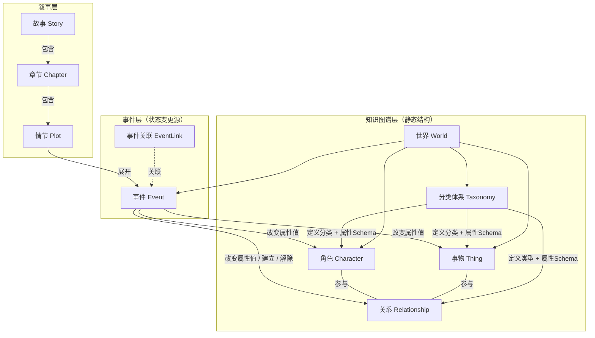

# 故事创作核心概念建模

本文档定义 Imagix 故事创作系统的核心概念模型（Meta-Model）。

## 设计原则

### 原则 1: 抽象概念 vs 世界实例

本文档定义的是**抽象元模型**——即概念的"骨架"。具体的关系类型、属性定义、分类体系等，都在每个**世界实例**中标准化定义。

```
元模型层:  分类体系（抽象概念）  → "分类节点可携带属性定义，子节点继承"
世界实例层: 修仙世界.角色分类.修仙者 → 定义属性{修为境界, 灵根, 寿元...}
```

### 原则 2: 静态参数 + 事件溯源

每个概念实体上只存储**静态不变的参数**（如角色的 ID、所属世界、分类）。

所有**可变状态**（属性值、关系属性值）不直接存储，而是通过**事件溯源（Event Sourcing）** 推算：

```
给定时间点 T → 筛选 T 之前的所有事件 → 按时间顺序应用事件的影响 → 得出 T 时刻的状态
```

事件是唯一的状态变更源（Single Source of Truth）。用户在界面上的编辑操作（如修正角色名）属于"故事外行为"，不受此约束。

## 整体架构

10 个概念分为三层：



## 概念定义

### 1. 世界 (World)

故事世界，所有概念的顶层容器。

| 参数     | 说明                                             |
| -------- | ------------------------------------------------ |
| 名称     | 世界名称                                         |
| 世界观   | 世界观描述                                       |
| 世界设定 | 物理法则、力量体系、社会规则等                   |
| 时间纪元 | 标准化定义（如：盘古历、公元纪年）               |
| 分类体系 | 角色分类树、事物分类树、关系类型树（见概念 5）   |

### 2. 角色 (Character)

世界中有主观能动性的行为体（人、动物、妖怪、神仙等）。

| 参数         | 说明                                   |
| ------------ | -------------------------------------- |
| ID           | 唯一标识                               |
| 所属世界     | 关联的世界                             |
| 分类节点引用 | 从角色分类树中选取                     |

可变属性由所属分类节点（含继承链）定义 Schema，属性值由事件推算。

### 3. 事物 (Thing)

世界中无主观能动性的实体（道具、场所、地点、势力等）。

| 参数         | 说明                                   |
| ------------ | -------------------------------------- |
| ID           | 唯一标识                               |
| 所属世界     | 关联的世界                             |
| 分类节点引用 | 从事物分类树中选取                     |

可变属性由所属分类节点（含继承链）定义 Schema，属性值由事件推算。

### 4. 关系 (Relationship)

实体之间的**有向**二元关系，每个关系用一个词精确表达。

| 参数             | 说明                                   |
| ---------------- | -------------------------------------- |
| ID               | 唯一标识                               |
| 关系类型节点引用 | 从关系类型树中选取                     |
| from             | 源实体引用                             |
| to               | 目标实体引用                           |

**有向性：** 每个关系有明确的 `from`（源）和 `to`（目标），关系类型定义了方向的语义。

**三种类型：**

- 角色→角色：父子（from=父, to=子）、师徒（from=师, to=徒）、情侣（from/to 对称）
- 角色→事物：拥有（from=角色, to=道具）、投靠（from=角色, to=势力）
- 事物→事物：包含（from=国家, to=城池）、隶属（from=分舵, to=总坛）

**属性有向性：** 关系属性按 from→to 和 to→from 两个方向分别持有值。例如在"父子"关系中：from→to 称谓="儿子"，to→from 称谓="父亲"。

可变属性由关系类型节点（含继承链）定义 Schema，属性值由事件推算。

### 5. 分类体系 (Taxonomy)

角色分类、事物分类、关系类型的树形结构定义，在世界层面标准化。

**属性定义（Schema）挂在分类节点上，子节点继承父节点的所有属性定义。**

| 参数         | 说明                                             |
| ------------ | ------------------------------------------------ |
| 节点 ID      | 唯一标识                                         |
| 名称         | 分类名称                                         |
| 父节点引用   | 构成树形结构                                     |
| 属性定义列表 | 该节点追加的属性 Schema（子节点自动继承）         |

**三棵树：** 角色分类树、事物分类树、关系类型树。

每个世界独立定义自己的分类体系，用户可在任意节点下增加子分类。

#### 属性继承示例

**角色分类树：**

```
生物 → 定义属性: {姓名, 年龄}
  └─ 人类 → 继承{姓名, 年龄} + 追加{身高, 体型}
      └─ 修仙者 → 继承{姓名, 年龄, 身高, 体型} + 追加{修为境界, 灵根}
```

**事物分类树：**

```
事物（根）→ 定义属性: {名称, 描述}
  └─ 地点 → 继承{名称, 描述} + 追加{人口, 繁荣度}
  └─ 组织 → 继承{名称, 描述} + 追加{实力, 成员数}
  └─ 道具 → 继承{名称, 描述} + 追加{品级, 耐久度}
```

**关系类型树：**

```
关系（根）→ 定义属性: {称谓}
  └─ 角色间关系 → 继承{称谓} + 追加{好感度}
      └─ 血缘关系 → 继承{称谓, 好感度}（父子、母女等）
      └─ 社会关系 → 继承{称谓, 好感度} + 追加{信任度}（师徒、君臣等）
```

### 6. 事件 (Event)

在某个时间、某个地点，某些角色/事物发生的一件事。

**事件是所有可变状态的唯一变更源。**

| 参数             | 说明                                             |
| ---------------- | ------------------------------------------------ |
| ID               | 唯一标识                                         |
| 时间戳           | 世界纪元内的时间点                               |
| 地点             | 引用事物                                         |
| 参与者           | 角色/事物引用列表                                |
| 内容             | 提纲挈领的关键梗概，不做详细展开                 |
| 状态影响声明     | 该事件导致的属性值变化及关系的建立/解除           |

### 7. 事件关联 (EventLink)

事件之间的相关性标记，用于 AI 检索时还原上下文。

| 参数         | 说明                                   |
| ------------ | -------------------------------------- |
| 事件 A 引用  | 关联的第一个事件                       |
| 事件 B 引用  | 关联的第二个事件                       |
| 关联说明     | 可选的简短描述                         |

当 AI 处理某个事件时，可沿关联链检索相关事件，获得完整的上下文信息。

### 8. 情节 (Plot)

对事件的文学化展开。

| 参数         | 说明                                   |
| ------------ | -------------------------------------- |
| ID           | 唯一标识                               |
| 关联事件     | 引用一个或多个事件                     |
| 视角         | 从哪个角色视角叙述                     |
| 文风         | 文学风格                               |
| 内容         | 文学化文本                             |

**约束：** 情节不能超越事件本身设定的框架。

### 9. 故事 (Story)

一系列情节的有序集合。

| 参数         | 说明                                   |
| ------------ | -------------------------------------- |
| ID           | 唯一标识                               |
| 标题         | 故事标题                               |
| 关联世界     | 故事所在的世界                         |

故事可包含多个章节。

### 10. 章节 (Chapter)

故事的结构化分段。

| 参数         | 说明                                   |
| ------------ | -------------------------------------- |
| ID           | 唯一标识                               |
| 所属故事     | 关联的故事                             |
| 序号         | 章节顺序                               |
| 标题         | 章节标题                               |
| 情节列表     | 有序的情节引用列表                     |

## 状态推算示例

以"张三的修为境界"为例：

```
世界: 修仙世界
角色: 张三 (category: 人类 > 修仙者)
分类继承的属性 Schema: {姓名, 年龄, 身高, 体型, 修为境界, 灵根}

事件链:
  t=100: "张三开始修炼" → 修为境界 = 练气期
  t=200: "张三突破"     → 修为境界 = 筑基期
  t=350: "张三走火入魔" → 修为境界 = 练气期（跌境）

查询 t=250 → 筛选 t<=250 的事件 → 最后生效: t=200 → 修为境界 = 筑基期
查询 t=400 → 筛选 t<=400 的事件 → 最后生效: t=350 → 修为境界 = 练气期
```
