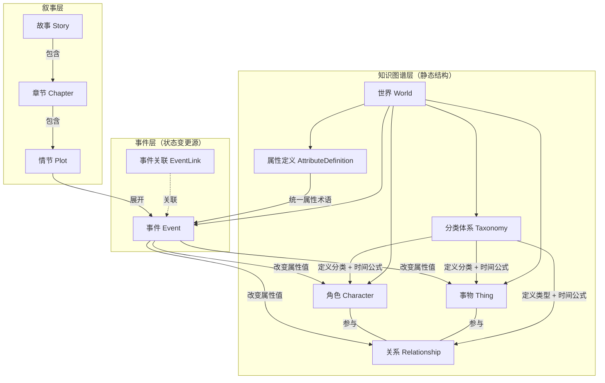

# 故事创作核心概念建模

本文档定义 Imagix 故事创作系统的核心概念模型（Meta-Model），并记录已实现的系统行为。

## 设计原则

### 原则 1: 抽象概念 vs 世界实例

本文档定义的是**抽象元模型**——即概念的"骨架"。具体的关系类型、属性定义、分类体系等，都在每个**世界实例**中标准化定义。

```
元模型层:  分类体系（抽象概念）  → "分类节点可携带属性定义，子节点继承"
世界实例层: 修仙世界.角色分类.修仙者 → 定义属性{修为境界, 灵根, 寿元...}
```

### 原则 2: 静态参数 + 事件溯源

每个概念实体上只存储**静态不变的参数**（如角色的 ID、所属世界、分类）。

所有**可变状态**（属性值、关系属性值）不直接存储，而是通过**事件溯源（Event Sourcing）** 推算：

```
给定时间点 T → 筛选 T 之前的所有事件 → 按时间顺序应用事件的影响 → 得出 T 时刻的状态
```

事件是唯一的状态变更源（Single Source of Truth）。用户在界面上的编辑操作（如修正角色名）属于"故事外行为"，不受此约束。

### 原则 3: 实体生命周期

每个实体（角色/事物/关系）都有明确的**创生→存续→消亡**生命周期：

- **创生**：创建实体时自动生成创生事件（系统事件），设 `$alive=true`、`$age=0`、`$name`。
- **存续**：实体存活期间，`$age` 随时间自动递增，`$alive` 保持 `true`。
- **消亡**：通过专用 API 标记消亡，生成消亡事件（系统事件），设 `$alive=false`。消亡后 `$age` 停止增长，状态冻结在消亡时刻。

消亡是可撤销的——支持"撤销消亡"操作。实体的删除采用**软删除**（`deletedAt` 时间戳），保留引用完整性。

## 整体架构

11 个概念分为三层：



## 概念定义

### 1. 世界 (World)

故事世界，所有概念的顶层容器。

| 参数     | 说明                                             |
| -------- | ------------------------------------------------ |
| 名称     | 世界名称                                         |
| 描述     | 世界观简述                                       |
| 世界设定 | 物理法则、力量体系、社会规则等                   |
| 时间纪元 | 对 t=0 原点的文字说明（如「盘古开天辟地」）       |

**创建时自动预置：**

- **纪元事件：** 一个 `time=0` 的系统事件，content 为纪元描述。
- **三棵分类树根节点：** 角色（CHAR）、事物（THING）、关系（REL），各自携带 `$age` 时间派生公式。
- **关系方向子节点：** 角色→角色、角色→事物、事物→事物（约束关系 from/to 的实体类型）。
- **三个系统属性定义：**
  - `$age`（timespan）—— 存续时间，随时间流逝自动递增。
  - `$name`（string）—— 实体名称。
  - `$alive`（boolean）—— 存活状态，创生时 `true`，消亡时 `false`。

### 2. 角色 (Character)

世界中有主观能动性的行为体（人、动物、妖怪、神仙等）。

| 参数         | 说明                                               |
| ------------ | -------------------------------------------------- |
| ID           | 唯一标识（`chr_` 前缀）                            |
| 所属世界     | 关联的世界                                          |
| 名称         | 角色名称                                            |
| 分类节点引用 | 从角色分类树 (CHAR) 中选取                          |
| 消亡事件 ID  | 若存在，表示该角色已消亡（可选）                     |
| deletedAt    | 软删除时间戳（可选，已删除实体从列表中过滤）         |

**创建时自动：** 接收 `birthTime` 参数，生成系统创生事件（含 `$age=0`、`$name`、`$alive=true`）。

可变属性由所属分类节点（含继承链）定义 Schema，属性值由事件推算。

### 3. 事物 (Thing)

世界中无主观能动性的实体（道具、场所、地点、势力等）。

| 参数         | 说明                                               |
| ------------ | -------------------------------------------------- |
| ID           | 唯一标识（`thg_` 前缀）                            |
| 所属世界     | 关联的世界                                          |
| 名称         | 事物名称                                            |
| 分类节点引用 | 从事物分类树 (THING) 中选取                         |
| 消亡事件 ID  | 若存在，表示该事物已消亡（可选）                     |
| deletedAt    | 软删除时间戳（可选）                                 |

**创建时自动：** 接收 `creationTime` 参数，生成系统创建事件（含 `$age=0`、`$name`、`$alive=true`）。

可变属性由所属分类节点（含继承链）定义 Schema，属性值由事件推算。

### 4. 关系 (Relationship)

实体之间的**有向**二元关系。

| 参数             | 说明                                               |
| ---------------- | -------------------------------------------------- |
| ID               | 唯一标识（`rel_` 前缀）                            |
| 关系类型节点引用 | 从关系类型树 (REL) 中选取                           |
| from             | 源实体 ID                                           |
| to               | 目标实体 ID                                         |
| 消亡事件 ID      | 若存在，表示该关系已解除（可选）                     |
| deletedAt        | 软删除时间戳（可选）                                 |

**创建时自动：** 接收 `establishTime` 参数，生成系统「建立」事件（含 `$age=0`、`$name=类型·源·目标`、`$alive=true`）。

**有向性：** 每个关系有明确的 `from`（源）和 `to`（目标），关系类型定义了方向的语义。

**三种方向类型：**

- 角色→角色：父子（from=父, to=子）、师徒（from=师, to=徒）
- 角色→事物：拥有（from=角色, to=道具）、投靠（from=角色, to=势力）
- 事物→事物：包含（from=国家, to=城池）、隶属（from=分舵, to=总坛）

**属性有向性：** 关系属性按 from→to 和 to→from 两个方向分别持有值。例如在"父子"关系中：from→to 称谓="儿子"，to→from 称谓="父亲"。

可变属性由关系类型节点（含继承链）定义 Schema，属性值由事件推算。

### 5. 分类体系 (Taxonomy)

角色分类、事物分类、关系类型的树形结构定义，在世界层面标准化。

| 参数           | 说明                                               |
| -------------- | -------------------------------------------------- |
| 节点 ID        | 唯一标识（`txn_` 前缀）                            |
| 分类树类型     | CHAR / THING / REL                                  |
| 名称           | 分类名称                                            |
| 父节点引用     | 构成树形结构，null 表示根节点                        |
| 时间派生公式   | 可选的 JSONata 表达式（子节点继承，可覆盖）          |
| system         | 系统预置节点，不可编辑或删除                         |

**三棵树：** 角色分类树、事物分类树、关系类型树。每个世界独立定义。

#### 时间派生公式 (timeFormula)

挂在分类节点上的 JSONata 表达式，用于在事件溯源回放时推算时间流逝导致的属性变化。

- **输入上下文：** `{ attributes, lastTime, currentTime }`
- **输出：** `Record<string, any>`（需要变更的属性名→新值映射）
- **继承规则：** 子节点继承父节点的公式，可覆盖。回放时按根→叶顺序依次执行。
- **默认公式：** 根节点预置 `{ "$age": attributes.$age + (currentTime - lastTime) }`

#### 属性继承示例

```
角色分类树:
  角色（根）→ 预置时间公式: $age 自动递增
    └─ 人类 → 追加属性定义{身高, 体型}
        └─ 修仙者 → 追加属性定义{修为境界, 灵根}
            → 继承属性: {$age, $name, $alive, 身高, 体型, 修为境界, 灵根}

关系类型树:
  关系（根）
    └─ 角色→角色
        └─ 血缘关系（父子、母女等）→ 追加属性定义{称谓}
    └─ 角色→事物
        └─ 拥有
    └─ 事物→事物
        └─ 包含
```

### 6. 属性定义 (AttributeDefinition)

世界级别的属性术语字典，所有实体的属性变更引用此字典，确保术语一致。

| 参数         | 说明                                               |
| ------------ | -------------------------------------------------- |
| ID           | 唯一标识（`adf_` 前缀）                            |
| 名称         | 属性名称，如「修为境界」                            |
| 类型         | string / number / boolean / enum / timestamp / timespan |
| 枚举值列表   | 当类型为 enum 时的可选值                             |
| 描述         | 属性说明                                            |
| system       | 系统预置属性，不可编辑或删除                         |

**系统预置属性：** `$age`（timespan）、`$name`（string）、`$alive`（boolean）。

### 7. 事件 (Event)

在某个时间、某个地点，某些角色/事物发生的一件事。

**事件是所有可变状态的唯一变更源。**

| 参数             | 说明                                             |
| ---------------- | ------------------------------------------------ |
| ID               | 唯一标识（`evt_` 前缀）                          |
| 时间             | 世界纪元毫秒时间戳（相对于 t=0）                 |
| 持续时间         | 毫秒，默认 0 表示瞬时事件                        |
| 地点             | 引用事物（可选）                                  |
| 参与者           | 角色/事物 ID 列表                                |
| 内容             | 提纲挈领的关键梗概                               |
| 状态影响声明     | 属性变更列表 + 关系属性变更列表                   |
| system           | 系统预置事件（创生/消亡/纪元），编辑受限          |

#### 系统事件分类

| 类型     | 特征                     | 可编辑字段         | 可删除 |
| -------- | ------------------------ | ------------------ | ------ |
| 纪元事件 | system=true, 无参与者    | content            | 否     |
| 创生事件 | system=true, $alive=true | time, content      | 否     |
| 消亡事件 | system=true, $alive=false| time, content      | 是     |
| 普通事件 | system=false             | 全部               | 是     |

#### 状态影响声明 (StateImpact)

```typescript
{
  attributeChanges: [          // 实体属性变更列表
    { entityType, entityId, attribute, value }
  ],
  relationshipAttributeChanges: [  // 关系属性变更列表
    { relationshipId, attribute, direction, value }
  ]
}
```

> 实体的创生/消亡由专用生命周期 API 管理，不通过事件 impact 中的关系变更操作。

#### 时序约束

- 创建事件时，校验参与者在事件时间点必须存续（未消亡）。
- 修改创生事件时间时，必须早于该实体的消亡事件时间。
- 修改消亡事件时间时，必须晚于该实体的创生事件时间。

### 8. 事件关联 (EventLink)

事件之间的无向相关性标记，用于 AI 检索时沿关联链还原上下文。

| 参数         | 说明                                   |
| ------------ | -------------------------------------- |
| 事件 A 引用  | 关联的第一个事件                       |
| 事件 B 引用  | 关联的第二个事件                       |
| 关联说明     | 可选的简短描述                         |

**自动创建场景：** 消亡操作指定 `causeEventId` 时，自动创建消亡事件与因果事件之间的关联。

### 9. 情节 (Plot)

对单个事件的文学化展开。一个事件可生成多个不同版本的情节（一对多）。

| 参数         | 说明                                   |
| ------------ | -------------------------------------- |
| ID           | 唯一标识（`plt_` 前缀）               |
| 关联事件     | 引用一个事件                           |
| 视角角色     | 从哪个角色视角叙述（null 为上帝视角）  |
| 文风         | 文学风格描述                           |
| 内容         | 文学化文本                             |

**约束：** 情节不能超越事件本身设定的框架。

### 10. 故事 (Story)

一系列章节的有序集合。

| 参数         | 说明                                   |
| ------------ | -------------------------------------- |
| ID           | 唯一标识（`sty_` 前缀）               |
| 标题         | 故事标题                               |
| 所属世界     | 故事所在的世界                         |
| 章节 ID 列表 | 有序列表，决定章节排列顺序             |

### 11. 章节 (Chapter)

故事的结构化分段。

| 参数         | 说明                                   |
| ------------ | -------------------------------------- |
| ID           | 唯一标识（`chp_` 前缀）               |
| 所属故事     | 关联的故事                             |
| 标题         | 章节标题                               |
| 情节 ID 列表 | 有序列表，决定情节排列顺序             |

## 虚拟历法

系统使用自定义虚拟历法，不依赖现实世界日历：

| 单位 | 换算                     |
| ---- | ------------------------ |
| 1 年 | 12 月                    |
| 1 月 | 30 天                    |
| 1 天 | 24 小时                  |
| 1 年 | 360 天 = 31,104,000,000 毫秒 |

**时间存储：** 所有时间以毫秒为单位，相对于世界纪元原点 (t=0)。负数表示纪元前。

**无零年规则：** 显示时年份从 1 开始（类似公元纪年），内部存储第 0 年显示为第 1 年。

**纪元切换：** 时间戳支持「纪元后」和「纪元前」两个方向。

## 状态推算机制

### 事件溯源流程

```
1. 确定实体类型（角色/事物/关系）
2. 查询实体信息（分类节点 + 消亡事件 ID）
3. 若实体已消亡且查询时间超过消亡时间 → 将有效时间截止到消亡时刻
4. 获取实体在有效时间内的所有事件
5. 构建分类继承链的时间派生公式（根→叶顺序）
6. 按时间顺序回放事件：
   a. 事件间隙：执行时间派生公式（如 $age 递增）
   b. 应用事件的 attributeChanges
   c. 创生事件固定 $age=0
   d. 事件有持续时间且实体未消亡 → 执行持续期内的时间派生公式
7. 最后一个事件到查询时间的间隙：若实体仍存活，执行时间派生公式
8. 返回 { entityId, time, attributes }
```

### 推算示例

```
世界: 修仙世界
角色: 张三 (category: 人类 > 修仙者)
继承的属性 Schema: {$age, $name, $alive, 身高, 体型, 修为境界, 灵根}

事件链:
  t=0:   纪元原点（系统事件）
  t=100: "张三诞生" → $age=0, $name="张三", $alive=true（系统创生事件）
  t=200: "张三开始修炼" → 修为境界 = 练气期
  t=350: "张三突破"     → 修为境界 = 筑基期
  t=500: "张三走火入魔" → 修为境界 = 练气期（跌境）
  t=600: "张三身陨" → $alive=false（系统消亡事件）

查询 t=300 → 筛选 t<=300 的事件 → $age=200, 修为境界=练气期
查询 t=450 → 筛选 t<=450 的事件 → $age=350, 修为境界=筑基期
查询 t=700 → 实体已消亡(t=600) → 有效时间截止到 600 → $age=500, $alive=false
```

### `forEvent` 选项

查询状态时可传 `forEvent` 参数，排除指定事件的影响。用于编辑事件时显示「事件发生前」的状态快照。

## ID 体系

所有实体使用 30 字符的前缀 ULID：

```
格式: pfx_crockford_base32(128bit_ulid)
      ^^^
      3字符实体类型前缀

前缀表:
  wld — 世界     txn — 分类节点   adf — 属性定义
  chr — 角色     thg — 事物       rel — 关系
  evt — 事件     sty — 故事       chp — 章节
  plt — 情节
```

## API 概览

### 世界与配置
| 方法   | 路径                                          | 说明               |
| ------ | --------------------------------------------- | ------------------ |
| POST   | `/api/worlds`                                 | 创建世界（含自动预置） |
| GET    | `/api/worlds`                                 | 列出用户的所有世界 |
| GET    | `/api/worlds/:worldId`                        | 获取世界详情       |
| PUT    | `/api/worlds/:worldId`                        | 更新世界           |
| DELETE | `/api/worlds/:worldId`                        | 删除世界           |
| GET    | `/api/worlds/:worldId/export`                 | 导出世界全部数据   |
| POST   | `/api/worlds/:worldId/import`                 | 导入世界数据       |

### 分类体系
| 方法   | 路径                                                | 说明             |
| ------ | --------------------------------------------------- | ---------------- |
| GET    | `/api/worlds/:worldId/taxonomy/:tree`               | 获取分类树       |
| POST   | `/api/worlds/:worldId/taxonomy/:tree`               | 创建分类节点     |
| PUT    | `/api/worlds/:worldId/taxonomy/:tree/:nodeId`       | 更新分类节点     |
| DELETE | `/api/worlds/:worldId/taxonomy/:tree/:nodeId`       | 删除分类节点     |

### 属性定义
| 方法   | 路径                                                   | 说明             |
| ------ | ------------------------------------------------------ | ---------------- |
| GET    | `/api/worlds/:worldId/attribute-definitions`           | 列出属性定义     |
| POST   | `/api/worlds/:worldId/attribute-definitions`           | 创建属性定义     |
| PUT    | `/api/worlds/:worldId/attribute-definitions/:adfId`    | 更新属性定义     |
| DELETE | `/api/worlds/:worldId/attribute-definitions/:adfId`    | 删除属性定义     |

### 角色（含生命周期）
| 方法   | 路径                                                | 说明                     |
| ------ | --------------------------------------------------- | ------------------------ |
| POST   | `/api/worlds/:worldId/characters`                   | 创建角色（含自动创生事件） |
| GET    | `/api/worlds/:worldId/characters`                   | 列表（自动过滤已软删除） |
| GET    | `/api/worlds/:worldId/characters/:charId`           | 获取详情               |
| PUT    | `/api/worlds/:worldId/characters/:charId`           | 更新角色               |
| DELETE | `/api/worlds/:worldId/characters/:charId`           | 软删除角色             |
| POST   | `/api/worlds/:worldId/characters/:charId/end`       | 标记消亡               |
| DELETE | `/api/worlds/:worldId/characters/:charId/end`       | 撤销消亡               |

### 事物（含生命周期）
| 方法   | 路径                                              | 说明                    |
| ------ | ------------------------------------------------- | ----------------------- |
| POST   | `/api/worlds/:worldId/things`                     | 创建事物（含自动创建事件） |
| GET    | `/api/worlds/:worldId/things`                     | 列表                   |
| GET    | `/api/worlds/:worldId/things/:thingId`            | 获取详情               |
| PUT    | `/api/worlds/:worldId/things/:thingId`            | 更新事物               |
| DELETE | `/api/worlds/:worldId/things/:thingId`            | 软删除事物             |
| POST   | `/api/worlds/:worldId/things/:thingId/end`        | 标记消亡               |
| DELETE | `/api/worlds/:worldId/things/:thingId/end`        | 撤销消亡               |

### 关系（含生命周期）
| 方法   | 路径                                               | 说明                       |
| ------ | -------------------------------------------------- | -------------------------- |
| POST   | `/api/worlds/:worldId/relationships`               | 创建关系（含自动建立事件） |
| GET    | `/api/worlds/:worldId/relationships`               | 列表                       |
| GET    | `/api/worlds/:worldId/relationships/:relId`        | 获取详情                   |
| DELETE | `/api/worlds/:worldId/relationships/:relId`        | 软删除关系                 |
| POST   | `/api/worlds/:worldId/relationships/:relId/end`    | 标记解除                   |
| DELETE | `/api/worlds/:worldId/relationships/:relId/end`    | 撤销解除                   |
| GET    | `/api/worlds/:worldId/entities/:entityId/relationships` | 查询实体的所有关系    |

### 事件
| 方法   | 路径                                              | 说明                       |
| ------ | ------------------------------------------------- | -------------------------- |
| POST   | `/api/worlds/:worldId/events`                     | 创建事件（含参与者存续校验） |
| GET    | `/api/worlds/:worldId/events`                     | 列表（可选 timeFrom/timeTo 过滤） |
| GET    | `/api/worlds/:worldId/events/:eventId`            | 获取详情                   |
| PUT    | `/api/worlds/:worldId/events/:eventId`            | 更新事件（系统事件受限）   |
| DELETE | `/api/worlds/:worldId/events/:eventId`            | 删除事件                   |

### 事件关联
| 方法   | 路径                                           | 说明             |
| ------ | ---------------------------------------------- | ---------------- |
| POST   | `/api/worlds/:worldId/event-links`             | 创建事件关联     |
| GET    | `/api/worlds/:worldId/event-links`             | 列出事件关联     |
| DELETE | `/api/worlds/:worldId/event-links`             | 删除事件关联     |

### 实体状态查询
| 方法   | 路径                                                      | 说明                     |
| ------ | --------------------------------------------------------- | ------------------------ |
| GET    | `/api/worlds/:worldId/entities/:entityId/state?time=N`    | 事件溯源推算实体状态     |

### 故事 / 章节 / 情节
| 方法   | 路径                                                          | 说明           |
| ------ | ------------------------------------------------------------- | -------------- |
| POST   | `/api/worlds/:worldId/stories`                                | 创建故事       |
| GET    | `/api/worlds/:worldId/stories`                                | 列出世界故事   |
| GET    | `/api/stories`                                                | 列出用户故事   |
| GET/PUT/DELETE | `/api/worlds/:worldId/stories/:storyId`               | 故事 CRUD      |
| POST   | `/api/stories/:storyId/chapters`                              | 创建章节       |
| GET    | `/api/stories/:storyId/chapters`                              | 列出章节       |
| GET/PUT/DELETE | `/api/stories/:storyId/chapters/:chapterId`           | 章节 CRUD      |
| POST   | `/api/stories/:storyId/chapters/:chapterId/plots`             | 创建情节       |
| GET    | `/api/stories/:storyId/chapters/:chapterId/plots`             | 列出情节       |
| GET/PUT/DELETE | `/api/stories/:storyId/plots/:plotId`                 | 情节 CRUD      |

## 存储设计

### DynamoDB 单表设计

所有数据存储在一张 DynamoDB 表中，通过 PK/SK 前缀区分实体类型：

- **世界及其下属实体：** `PK=WORLD#worldId`，SK 按实体类型前缀分区。
- **实体→事件索引：** `PK=ENTITY#entityId`，SK=`EVT#time#eventId`，存储 `{worldId, eventId}` 用于按时间查询实体关联的事件。
- **事件 ID 查找索引：** SK=`EVT_IDX#eventId`，用于从事件 ID 直接定位事件（无需知道 time）。

> 注意：实体事件索引条目仅存储 `{worldId, eventId}`，不包含完整事件数据，需二次查询获取事件详情。